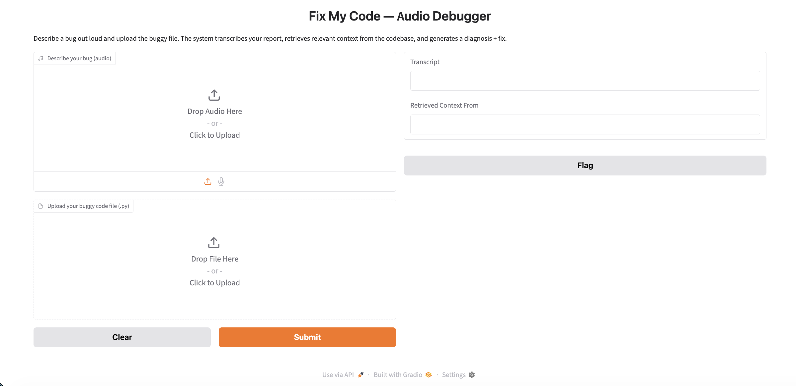
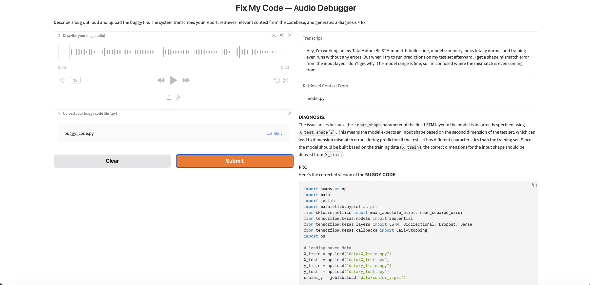

# Fix My Code — Audio Debugger

A RAG-based debugging assistant that takes a *spoken* bug report, retrieves relevant context from a real codebase, and generates a diagnosis and fix.

---

## How It Works

1. **Transcription** — Whisper (via `faster-whisper`) converts the audio bug report to text, primed with a domain vocabulary hint for technical terms.
2. **Retrieval** — The transcript and buggy code are embedded together and searched against a FAISS index of the target codebase, chunked at the function/class level using Python's `ast` module.
3. **Generation** — Retrieved context, the transcript, and the buggy code are combined into a structured prompt sent to Qwen2.5-Coder-7B-Instruct, which returns a diagnosis and a fix.

    Audio bug report → Whisper → Transcript
                                     ↓
    Buggy code ──────────────→ Retrieval query
                                     ↓
                        FAISS search over indexed codebase
                                     ↓
                      Retrieved context + transcript + buggy code
                                     ↓
                         Qwen2.5-Coder-7B-Instruct
                                     ↓
                           Diagnosis + Fixed code

---

## Test Corpus

The retrieval corpus is built from a real project — a Tata Motors stock price predictor (BiLSTM model, FastAPI serving layer, data preprocessing pipeline). Three real bugs from that project's development history serve as test cases.

| Sample | Bug Type | Root Cause |
|---|---|---|
| `sample_1_shape_bug` | Shape mismatch at inference | `input_shape` mixed `X_train`/`X_test` dimensions |
| `sample_2_serving_hang` | FastAPI endpoint hangs | Blocking I/O + TensorFlow threading under async |
| `sample_3_scaler_leakage` | Inflated test metrics | Scaler fit before train/test split |

Each sample includes an audio bug report, ground-truth transcript, buggy code, and the actual fix — used to validate every pipeline stage against real outcomes, not just "does it run."

---

## Results

| Sample | Retrieval | Diagnosis | Fix |
|---|---|---|---|
| Shape bug | Correct file | Correct | Correct |
| Serving hang | Correct file | Correct direction | Partial — addressed blocking I/O, missed TF threading fix |
| Scaler leakage | Correct file | Correct | Correct |

**Known limitation:** correct retrieval doesn't guarantee correct generation. In the serving-hang case, the model retrieved the right file but the generated fix only addressed part of the actual root cause — a genuine RAG failure mode worth understanding, not just a bug to patch away.

---

## Setup

Install dependencies:

```bash
pip install -r requirements.txt
```

Create a `.env` file in the project root with your Hugging Face token (needs **Inference Providers** permission enabled):

    HF_TOKEN=your_token_here

Build the retrieval index (if not already committed to the repo):

```bash
python -m tests.test_embedding
```

---

## Run

```bash
python app.py
```

Opens a Gradio interface at `http://127.0.0.1:7860`. Upload an audio bug report and the corresponding code file to get a diagnosis and fix.

---

## Tech Stack

- **`faster-whisper`** — speech-to-text
- **`sentence-transformers`** (`all-MiniLM-L6-v2`) — embeddings
- **`faiss-cpu`** — vector search
- **`langchain-huggingface`** + Qwen2.5-Coder-7B-Instruct — generation
- **`gradio`** — interface

---

## Project Structure

```
├── app.py                    # Gradio interface
├── src/
│   ├── transcribe.py         # Whisper transcription
│   ├── chunk.py               # AST-based code chunking
│   ├── embed.py                # Embedding + FAISS index building
│   ├── retrieve.py              # Retrieval logic
│   ├── prompt.py                 # Prompt template
│   ├── generate.py                 # LLM generation
│   └── pipeline.py                   # End-to-end orchestration
├── corpus/                    # Indexed codebase (Tata Motors project)
├── debugger_test_data/        # 3 validated test samples
└── tests/                     # Validation scripts for each pipeline stage
```

---

## Example Output

**Interface:**



**Sample result** — audio bug report → transcript → retrieved context → diagnosis + fix:

